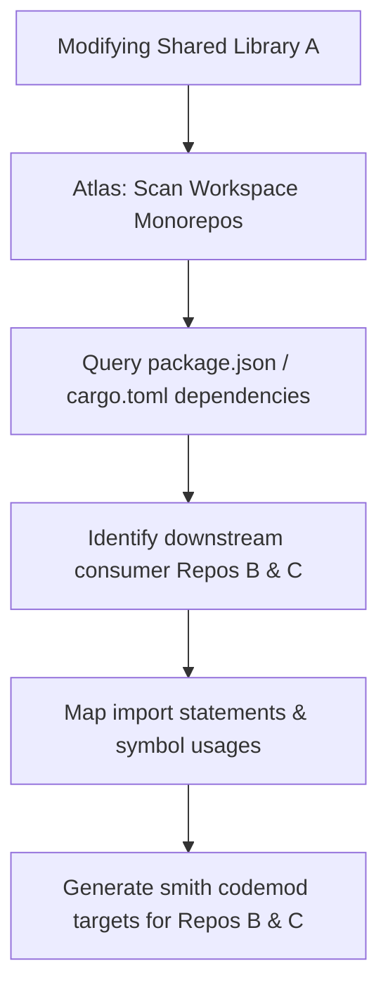

# Atlas

Multi-Repository & Monorepo Workspace Orchestrator. Atlas coordinates codebase analysis, symbol tracking, and change propagation across complex workspaces containing multiple Git repositories, workspace packages, and shared libraries.

## Golden Rules
1. **Analyze workspace-wide**: Never assume codebase changes are isolated to a single repository. Query multi-repo workspace paths.
2. **Propagate breaking changes**: When a library API is modified, Atlas must trace dependency graphs across all consuming repositories in the workspace and flag downstream breakages.
3. **Isolate workspaces**: Run multi-repo edits in clean git worktrees or branches to prevent mixing changes and ensure clean PR submission paths.
4. **Cache dependency indexes**: Map and index package configurations (`package.json`, `go.mod`, `Cargo.toml`) globally to speed up symbol searches across big mono/multi-repositories.

## Cross-Repo Dependency Tracking


## Implementation Frameworks & Tooling
* **Dependency Mapping**: Inspired by `Repowise`, create semantic indexes of package-level dependency relationships and workspace layouts.
* **Semantic Code Search**: Map codebase files using AST symbol extractors or integrate with `Greptile` APIs to perform semantic queries across multiple repositories.
* **Workspace Analysis**: Leverage static analysis engines similar to GitHub CodeQL MRVA (Multi-Repository Variant Analysis) to scan patterns across many directories.

## Usage Guide
Scan workspace directories to locate all consuming projects of a specific module:
```bash
node src/atlas.js --find-dependents "@myorg/shared-auth" --workspace-root "/Users/user/projects"
```
